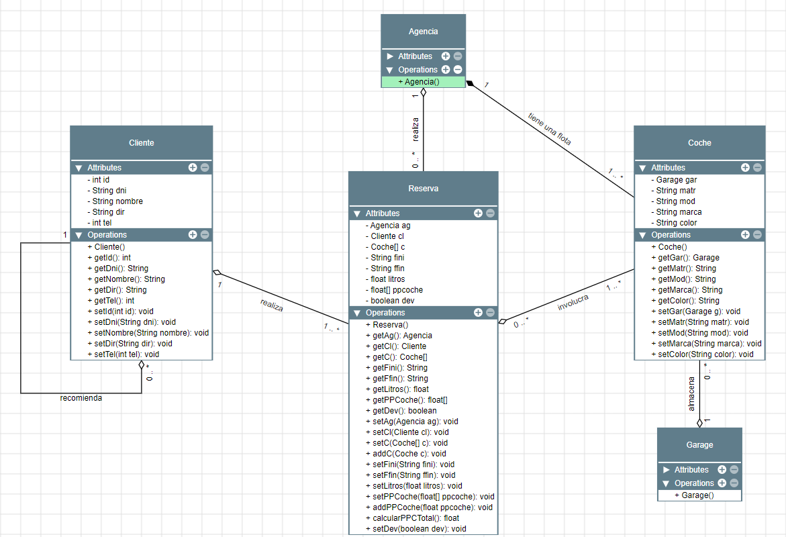

# Simulacro de Examen II Entornos de Desarrollo 3er Trimestre

Simulacro de examen II de la asignatura **Entornos de Desarrollo** de DAM (CESUR Mallorca) para el curso 2022-2023.

## :clipboard: Enunciado:

Se desea diseñar un diagrama de clases sobre la información de las reservas de una empresa dedicada al alquiler de automóviles, teniendo en cuenta que:

-  Un determinado cliente puede tener en un momento dado hechas varias reservas.
-  De cada cliente se desea almacenar su DNI, nombre, dirección y teléfono. Además dos clientes se diferencian con un código único. Cada cliente puede ser avalado por otro cliente de la empresa.
-  Una reserva la realiza un único cliente pero puede involucrar varios coches.
-  Es importante registrar la fecha de inicio y final de la reserva, el precio del alquiler de cada uno de los coches, litros de gasolina en el depósito en el momento de realizar la reserva, precio total de la reserva y un indicador de si el coche o los coches han sido entregados.
-  Todo coche tiene siempre asignado un determinado garage que no puede cambiar. De cada coche se requiere la matrícula, el modelo, el color y la marca.
-  Cada reserva se realiza en una determinada agencia.

## :mag: Análisis de entidades:

Dado el enunciado anterior, se distinguen los siguientes elementos para el diagrama de clases a desarrollar:

-  Agencia
-  Coche
-  Garage
-  Cliente
-  Reserva

Cada una de estas entidades tendrá los atributos que se han mencionado en el enunciado.

## :bulb: Solución propuesta:

## :pencil2: Posibles mejoras

-  Los modelos de coches, marcas y colores podrían ser acotados mediante clases de tipo Enum para mayor integridad.
-  Se ha establecido la relación entre Agencia y Coche como composición dado que se ha supuesto que una agencia de alquileres no puede existir sin tener coches para alquilar.
-  Cabe mencionar que un Coche puede estar en varias reservas siempre y cuando sean con fechas diferentes. Este hecho debería ser tratado de alguna forma, ya sea en el modelo o mediante instrucciones cuando se traduzca a código fuente.
